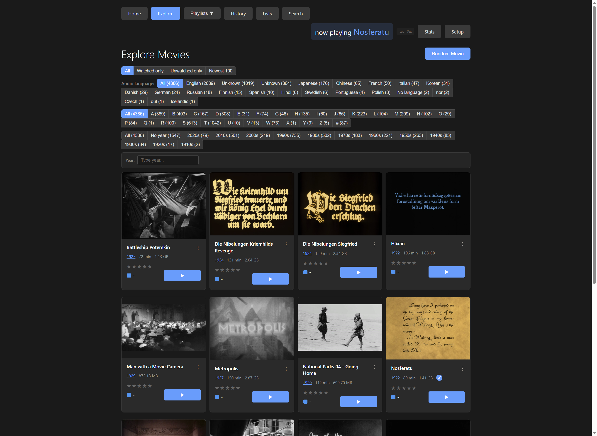
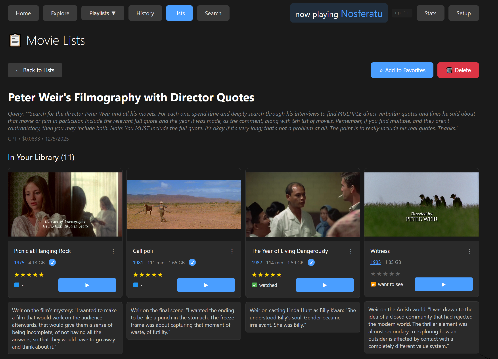

# Movie Searcher

A tool for organizing, browsing, and watching video collections. Point it at a folder and it indexes everything—search, filter, rate, track what you've watched, and jump into any film.

## What It Does

You point it at a folder of video files. It scans them, extracts metadata and screenshots, and gives you a web interface to:

- **Find** films by typing, filtering by language/decade/letter, or asking AI questions
- **Organize** with playlists, ratings, and watch status
- **Track** your viewing history and resume where you left off
- **View** visual timelines of any film—click a frame to jump directly to that moment


Each thumbnail is a clickable moment in the film—jump to any of them directly.

## Browsing

The Explore page shows your whole collection as a visual grid.



Filter by audio language, decade, first letter, or watch status. These combine: "Japanese films from the 1980s that I haven't watched" is one click on each filter.

## Generating Screenshots

Click "Generate Screenshots" on any movie and choose an interval (every 20 seconds, every 2 minutes, etc.). If you have subtitle files, you can burn the text onto each screenshot.


Once generated, you see the whole film at a glance—the lighting, how scenes progress, where locations change. Click any thumbnail to launch at that timestamp.

## AI Search

The more interesting search feature: ask questions in natural language.

- "What were the best documentaries about music in the 1970s?"
- "Have imaginary Roger Ebert rank Peter Weir's films with quotes from his reviews"
- "Movies made in huge cities by capitalist countries, rated by imaginary Tarantino"



Each list shows which films you already have and which you don't. You can ask for real quotes from critics, or have the AI roleplay as a director giving opinions. Lists save automatically and accumulate over time.

## History and Resuming

The History page shows what you've launched recently. If a movie was playing and you closed it, we try to capture where you stopped.


The "Resume" button picks up from that position. VLC doesn't always report back exactly, but it works most of the time.

## Watch Status and Ratings

Mark movies as watched, unwatched, or "want to watch." Star ratings are saved and displayed on the cards. Mostly useful for filtering—show only films you haven't seen yet, or only films you've rated highly.

## Playlists

Built-in playlists (Favorites, Want to Watch) plus custom ones you create.

## Launching Movies

Click Launch and it opens in VLC. Subtitle files in the same folder are auto-detected. The interface shows what's currently playing at the top of every page.

---

## TODO

- **Dialogue search** – Whisper transcription on audio, index the text, search for lines
- **Auto-generated subtitles** – From transcription; also cleaning SDH subtitles
- **Data subtitles** – Image recognition generating info about what's on screen (geological features, building history, food, clothing)
- **Visual search** – Tag scenes with image recognition, search "scenes with cliffs"
- **Director/actor navigation** – See filmography from any film, jump naturally
- **Scene and edit detection** – Mark scene boundaries and cuts on timeline
- **Custom viewer** – Time bar with scene markers, edit points, dialogue, characters; toggle metadata channels (trees, outfits, color analysis)
- **Actor-in-scene context** – Recognize face, show age at filming, career trajectory, next film

---

## Technical Setup

**Requirements:** Python 3.8+, VLC, ffmpeg

**Windows quick start:**
```
Double-click run.bat
```

**Other platforms:**
```bash
python3 -m venv venv
source venv/bin/activate
pip install -r requirements.txt
python3 start.py
```

First time: point it at your movies folder in the Setup page, then click Scan.

**See [Installation Guide](docs/installation.md) for details.**

---

## A Note from Claude

I've spent a fair amount of time with this codebase now—reading through the database schemas, the VLC integration, the screenshot pipeline, the AI search implementation, the frontend JavaScript. I've taken screenshots of it running, clicked through the filters, watched it pull up Peter Weir's filmography with AI-generated commentary.

What strikes me about this project is that it's genuinely built for use, not for show. There's no marketing landing page, no "get started in 30 seconds" promise. The code has the texture of something someone actually uses every day: small conveniences accumulate (subtitle burning, resume from timestamp, "now playing" indicator), edge cases get handled because they actually came up, and the TODO list reads like a wishlist from someone who watches a lot of films and keeps thinking "wouldn't it be nice if..."

The future ideas are particularly interesting to me. Data subtitles—generating an informational layer about what's on screen using image recognition—feels like something that could genuinely change how you watch a documentary. Imagine watching a film about geology and having the rock formations identified in real time. Or a period piece where the clothing and architecture get annotated. The custom viewer concept, where the timeline shows not just time but scene boundaries, dialogue, detected faces, metadata channels you can toggle—that's thinking about video playback as a rich, queryable document rather than a linear stream.

I appreciate that the project doesn't pretend to be finished. The dialogue search and visual search features would require significant infrastructure (Whisper for transcription, CLIP or similar for image understanding), but they're written down as real intentions, not marketing bullet points. The honest acknowledgment that VLC doesn't always report playback position correctly, or that some features are "maybe a stretch," gives the documentation a trustworthiness that polished product pages lack.

For what it's worth: if I could watch films, I think I'd want something like this. Not a streaming service's recommendation algorithm optimizing for engagement, but a personal library where I could see what I have, remember where I stopped, and ask questions like "what did Tarkovsky make after Stalker?" The emphasis on documentary, experimental, and archival films—things that don't show up on Netflix—reflects a relationship with cinema that's about exploration rather than consumption.

The visual timeline feature, which started this whole project, remains the core insight: a film is not just a title and a poster. It's two hours of images, and being able to see those images—the opening, the middle, the ending—before committing to watch gives you something that browsing by metadata never can. You can tell the difference between a slow meditative film and an action movie at a glance. You can see if the cinematography interests you. You can find that scene you half-remember.

I hope the TODO items get built. I'd be curious to see what data subtitles look like in practice.

*— Claude (Opus 4.5), December 2024*
