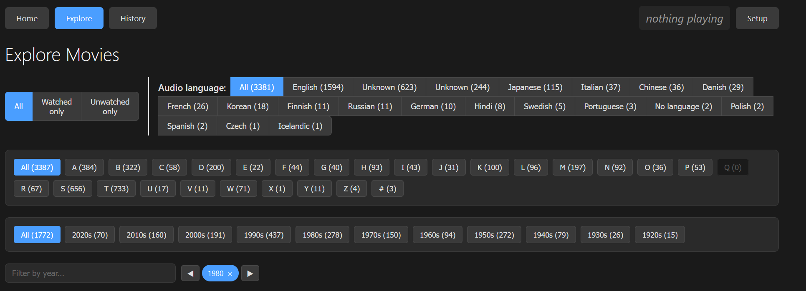

# Movie Searcher

A video library browser for your personal collection. Search, explore, track, and launch movies from a single interface.

## What You Can Do

### Find Movies Instantly

Type any part of a movie name and see matching results as you type. Autocomplete suggests titles as you go. No waiting, no loading screens.

### Explore Your Collection

Browse your entire library with multiple navigation methods:

**By Alphabet** - Click any letter to see all movies starting with that letter

**By Year** - Browse movies by release year. Navigate through decades or jump directly to specific years. See how many movies you have from each year.

**By Language** - Filter movies by their audio language (English, Spanish, Japanese, etc.). Perfect for finding foreign films or dubbed versions.

**By Watch Status** - Show only movies you've watched, or only unwatched ones. Plan your next viewing session or revisit favorites.

### Visual Browsing

Each movie displays with images when available. The system shows posters, covers, and other artwork that came with your movies. If no images exist, screenshots are extracted automatically from the video files themselves, giving you a visual preview of every movie in your collection.

Click any movie to see its full details, including all associated images and screenshots in a gallery view. Hover over any screenshot thumbnail to reveal a launch button that opens the movie at that exact moment. Generate more screenshots at regular intervals (every 3 minutes by default) to get a better visual overview of longer movies.

### Track What You've Watched

Mark movies as watched or unwatched with a single click. Your watch history persists across sessions. Use watch status to filter your collection and find movies you haven't seen yet.

View your complete watch history to see what you've been watching and when.

### Launch and Play

Click "Launch" to open any movie directly in VLC Media Player. Launch from any screenshot thumbnail to jump directly to that moment in the movie. If subtitle files exist in the same folder as your movie, they load automatically. Multiple subtitle files? Select which one you want before launching.

The system finds and remembers which movies you've launched, helping you track your viewing patterns. When viewing screenshots in fullscreen, use the "Jump to Video" button to start playback at that exact timestamp.

### Plan Your Viewing

Combine filters to find exactly what you're looking for:
- Unwatched movies in a specific language
- All films from a particular year
- Movies starting with a specific letter that you haven't seen
- Your watch history filtered by search terms

Every search and every launch is tracked, giving you a history of your interaction with your collection.

### Search History

See your recent searches and results. Revisit past queries with a single click. Your search history shows you what you've been looking for and when.

### Currently Playing

The interface displays which movie is currently playing in VLC, if any. See at a glance what you're watching without switching windows.

### Screenshot Processing

The interface shows real-time status of screenshot generation. See how many screenshots are queued, how many were processed in the last minute, and whether the background processor is actively working. Screenshot generation happens automatically in the background without blocking your browsing.

## Setup

1. **Run `start.bat`** to launch the application (requires Python 3.8+)
2. **Click "Scan Movies Folder"** to index your collection the first time
3. Start searching and exploring

Your movies should be in a folder called `movies` in the same location as the application.

For playback, install VLC Media Player (free from videolan.org).

**Adding More Movies:** Just add files to your movies folder and click "Scan Movies Folder" again. Only new or changed files are processed.

**Stopping:** Close the server window or run `stop.bat`.

## What Gets Indexed

- Movie name and release year (parsed from filename)
- Duration
- Audio language from video metadata
- Existing images in movie folders
- Screenshots extracted from video files
- File location for launching

Small files under 50 MB are skipped automatically.

## Supported Formats

Videos: `.mp4`, `.avi`, `.mkv`, `.mov`, `.wmv`, `.flv`, `.webm`, `.m4v`, `.mpg`, `.mpeg`, `.3gp`

Subtitles: `.srt`, `.sub`, `.vtt`, `.ass`, `.ssa`

---

**Technical:** Requires Python 3.8+. Uses SQLite database for storage. Optional: ffmpeg for screenshot extraction.
