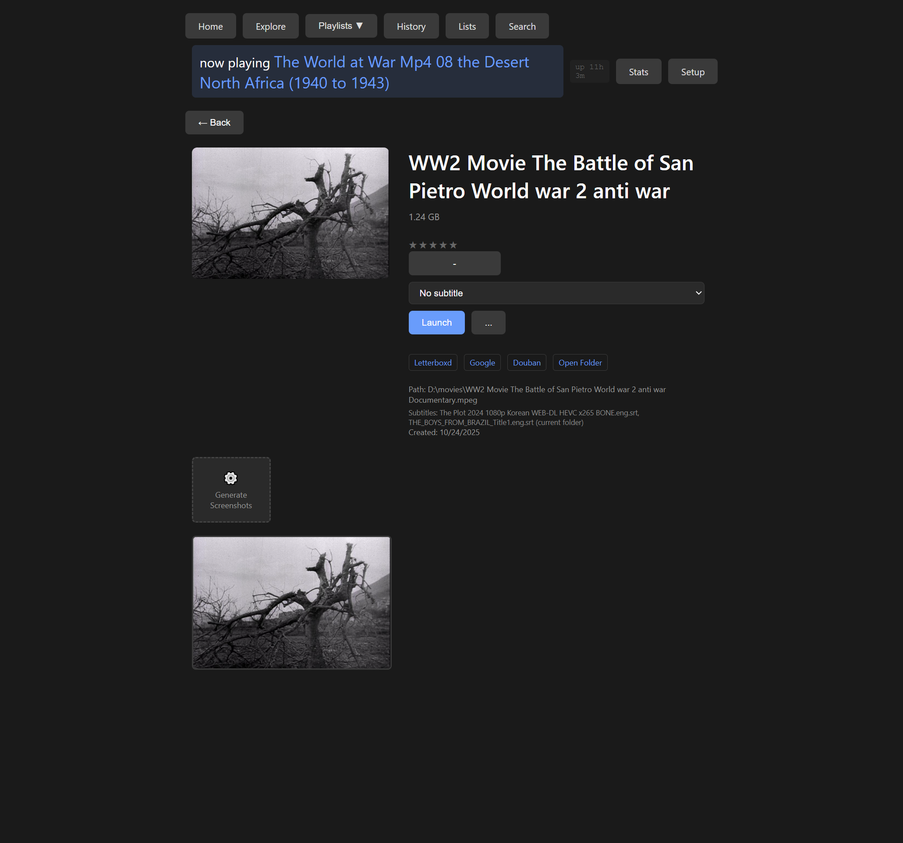

# Movie Searcher

Your personal movie library, the way it should be. Browse thousands of films visually, find what you want to watch instantly, and pick up exactly where you left off.


---

## Why This Exists

We built this because streaming services got slow and complicated. You have a movie collection—probably a large one—and you want to:

- **Find a movie in seconds**, not minutes of scrolling
- **See what's in each film** before you commit to watching it
- **Remember where you stopped** when life interrupts
- **Ask questions** like "What were Hitchcock's best thrillers?" and get answers from your own library

Movie Searcher runs on your computer, works instantly, and never phones home.

---

## Visual Browsing

Every movie gets a visual identity. Screenshots are extracted automatically from your video files, so you can see the cinematography, the mood, the era—all at a glance.


### Browse Your Way

- **By Letter**: Jump straight to films starting with any letter
- **By Decade**: 1910s through 2020s—see how your collection spans cinema history
- **By Language**: Filter by audio track—English, Japanese, French, Italian, Korean, Spanish, and dozens more
- **By Watch Status**: Show only unwatched films, or revisit your favorites

The Explore page shows your entire collection as a visual grid. Each card shows the movie's screenshot, year, duration, file size, and your rating.

---

## Instant Search

Type any part of a movie name and see results immediately. No loading screens, no waiting. The search updates as you type, with autocomplete suggestions for titles in your library.

Filter results by watch status—show all movies, only watched ones, or only those you haven't seen yet.

---

## AI-Powered Discovery

Ask questions about movies in plain English:

> "What were Kubrick's 10 most influential movies?"

> "Roger Ebert's essential 1970s cinema"

> "Cross-cultural films for a couple of friends, one Italian-American, one Australian"

The AI returns a curated list, showing which films you already own and which ones you might want to find. Each search is automatically saved as a Movie List you can revisit.


Your saved lists accumulate over time—"Tarantino's Favorite 1980s Films," "Mike Leigh Films Ranked by Public Reception," "Australian Dramas with Strong Aussie Accents." Each list shows how many movies it contains and how many are in your library.

---

## Watch History & Resume

Every time you launch a movie, it's recorded. The History page shows what you've been watching recently, with timestamps and the option to **resume exactly where you stopped**.


If you stopped watching at 45 minutes in, the Resume button appears—one click and you're back at that exact moment.

---

## Movie Details

Click any movie to see everything about it:



- **Screenshots**: Browse extracted frames from the film. Click any screenshot to launch the movie at that exact timestamp—perfect for jumping to a specific scene.
- **Generate More Screenshots**: Create a complete visual timeline at whatever interval you choose (every 20 seconds, 1 minute, 2 minutes, etc.)
- **Subtitles**: If subtitle files exist, pick which one to use. Subtitles are automatically detected and loaded.
- **Star Ratings**: Rate films 1-5 stars. Your ratings appear throughout the interface.
- **Quick Links**: Jump to Letterboxd, Google, or Douban to read reviews. Or open the folder to manage the file.
- **Watch Status**: Mark as watched, unwatched, or add to "Want to Watch."

### Screenshots with Subtitles

When you generate screenshots, Movie Searcher can burn the actual subtitle text onto each frame. See exactly what's being said at that moment in the film—useful for finding specific scenes or understanding foreign films at a glance.

---

## Playlists

Organize your collection with playlists:

- **Favorites**: Your most-loved films
- **Want to Watch**: Your watchlist
- **Custom Playlists**: Create your own themed collections

Access playlists from the navigation dropdown. Add any movie to any playlist from its detail page.

---

## Launch & Play

One click launches your movie in VLC Media Player. The interface shows what's currently playing at all times, so you always know what's running.

**Features when launching:**
- **Subtitle Selection**: Choose from available subtitle files before launching
- **Start at Timestamp**: Click any screenshot to launch at that exact moment
- **Resume Playback**: Continue from where you last stopped
- **Close Previous**: Optionally close existing VLC windows when launching a new film

---

## Batch Search

Have a list of movies you're looking for? Paste them all at once:

```
Casablanca 1942
The Godfather 1972
Citizen Kane 1941
Psycho 1960
```

Movie Searcher will open browser tabs to help you search for each one, tracking your progress through the list.

---

## Performance Stats

Track how fast movies launch. The Stats page shows:

- Average launch time in milliseconds
- Fastest and slowest launches
- VLC optimization flags being used
- Recent launch history

The goal is instant playback—movie starts within 50ms of clicking Launch.

---

## Setup

Point Movie Searcher at your movies folder and click Scan. It indexes everything:

- **Video files**: MP4, MKV, AVI, MOV, WMV, and more
- **Subtitles**: SRT files in the same folder
- **Metadata**: Duration, file size, audio language

Re-scan anytime to pick up new additions. Only changed files are re-processed.

### Settings You Can Configure

- **Movies Folder**: Where your collection lives (network drives work too)
- **Local Target Folder**: For copying movies offline
- **VLC Behavior**: Close existing windows, launch with subtitles on/off, hardware acceleration
- **Name Cleaning**: Smart cleaning of video filenames for display

---

## Statistics at a Glance

From the home page, you can always see:

- **Total Movies**: How many films are indexed
- **Watched Count**: How many you've seen (and what percentage)
- **Currently Playing**: What's running right now
- **Server Uptime**: How long Movie Searcher has been running

---

## Technical Details

**Requirements:**
- Python 3.8+
- VLC Media Player
- ffmpeg (auto-installed on Windows)

**Quick Start (Windows):**
```
Double-click run.bat
```

**Quick Start (Any Platform):**
```bash
python -m venv venv
source venv/bin/activate  # Windows: venv\Scripts\activate
pip install -r requirements.txt
python start.py
```

The launcher handles everything else—detecting/installing ffmpeg and VLC, setting up paths.

**See [Installation Guide](docs/installation.md) for detailed setup instructions.**

---

## Stopping

- Press `Ctrl+C` in the server window, or
- Run `python stop.py`

---

## What This Is Not

Movie Searcher is a personal tool for people who already have a movie collection. It doesn't:

- Stream content from the internet
- Download or acquire movies
- Connect to external databases (beyond AI search, which you configure)
- Track you or phone home

Your movies stay on your computer. Your data stays on your computer.

---

*Built for movie lovers who want their collection at their fingertips.*
