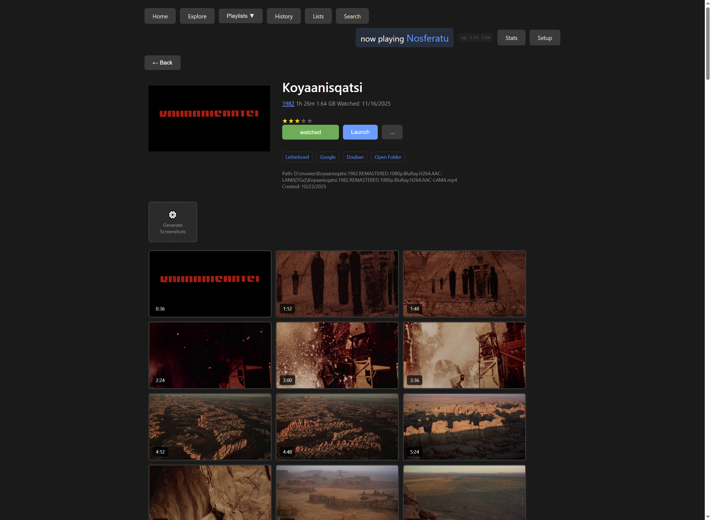
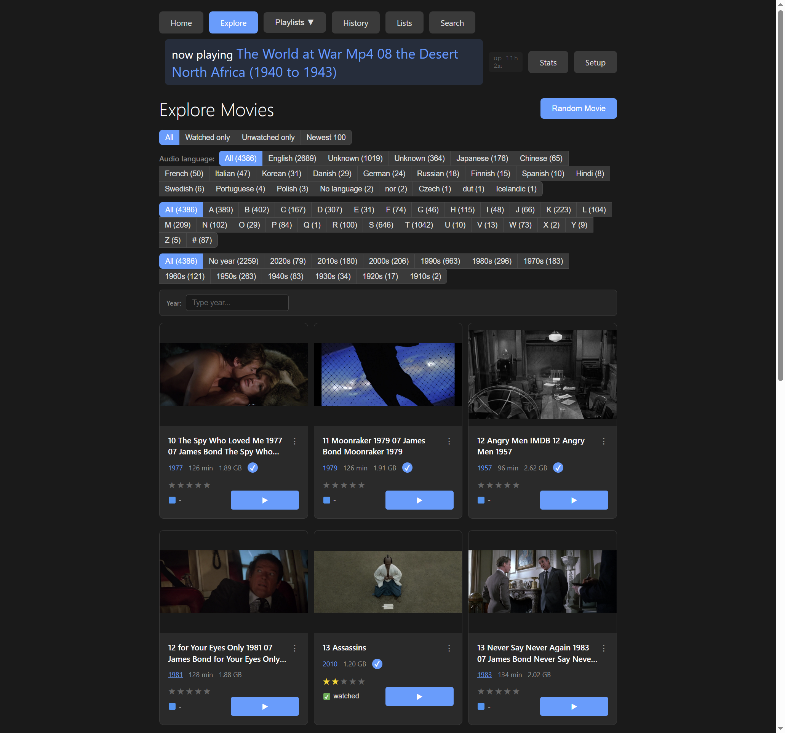
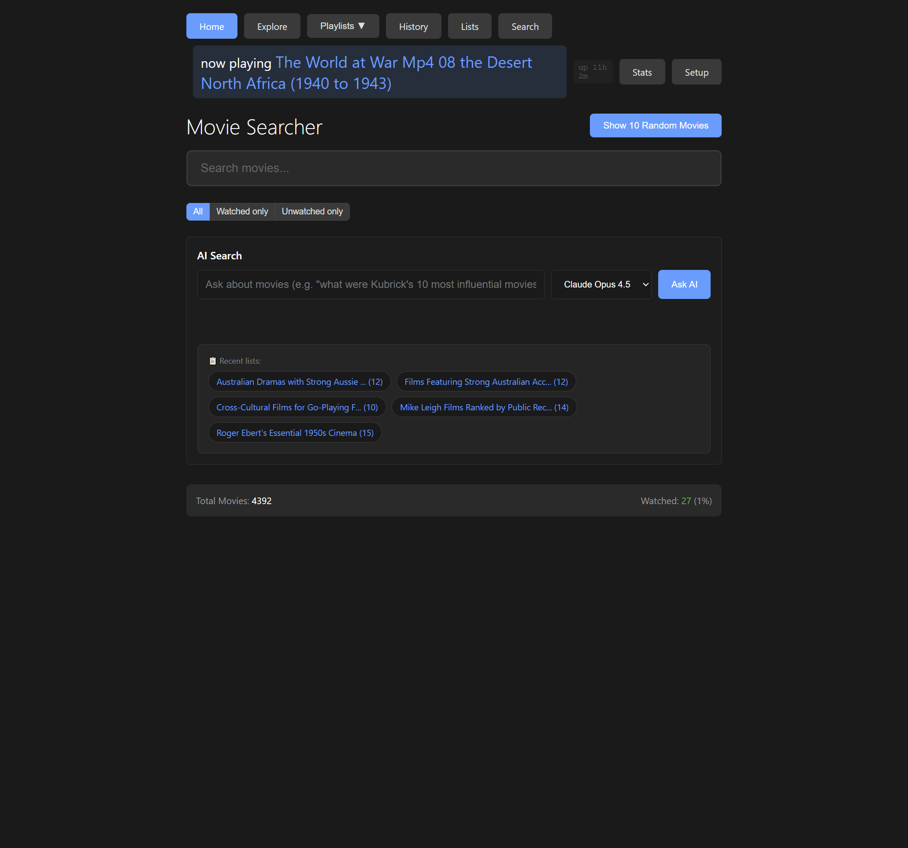
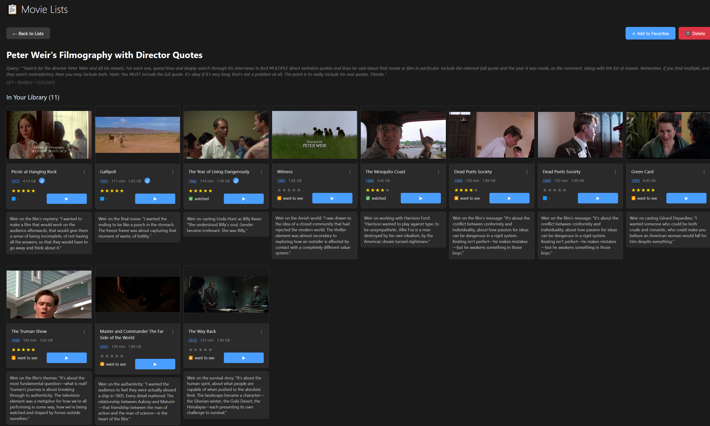
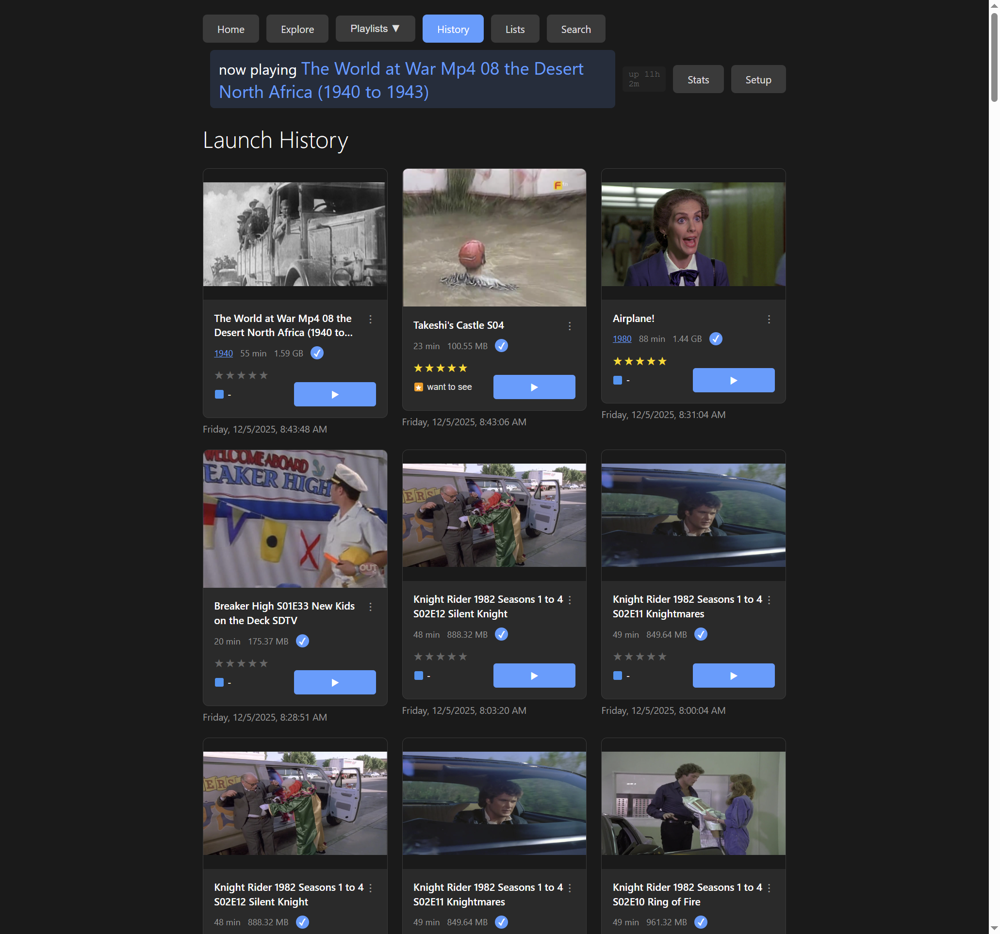

# Movie Searcher

A tool we built to organize, browse, and watch our video collections. Point it at a folder and it indexes everything—then lets you search, filter, rate, track what you've watched, and jump into any film instantly.

## What It Does

You point it at a folder of video files. It scans them, extracts metadata and screenshots, and gives you a web interface to:

- **Find** films by typing, filtering by language/decade/letter, or asking AI questions
- **Organize** with playlists, ratings, and watch status
- **Track** your viewing history and resume where you left off
- **View** visual timelines of any film—click a frame to jump directly to that moment

The screenshot timeline was the original motivation: being able to see frames from across a whole film—opening, middle, ending—without scrubbing through VLC manually. But it grew into a full library browser.



That's Koyaanisqatsi above. Each thumbnail is a clickable moment in the film. You can jump to any of them directly.

## Why We Made This

We have a lot of video files. Documentary films, experimental cinema, foreign films, archival footage—things that don't show up on streaming services. When you're trying to decide what to watch, clicking through Windows Explorer doesn't help much.

We wanted:
- To see what a film looks like before committing to watch it
- To remember where we stopped if we get interrupted
- To search by typing, not by navigating folders
- To filter by language, decade, or whether we've already seen something

So we built this for ourselves.

## Browsing

The Explore page shows your whole collection as a visual grid. Each card shows a frame from the movie.



You can filter by:
- **Audio language** – useful when you have films in many languages
- **Decade** – 1910s through 2020s
- **First letter** – quick alphabet navigation
- **Watch status** – show only things you haven't seen yet

These combine. "Japanese films from the 1980s that I haven't watched" is one click on each filter.

## Generating Screenshots

When you first scan your collection, each movie gets a default screenshot. But the useful thing is generating more—a visual timeline across the whole film.

Click "Generate Screenshots" on any movie and choose an interval (every 20 seconds, every 2 minutes, etc.). If you have subtitle files, you can burn the text onto each screenshot—so you can see exactly what's being said at that moment.

This takes a while for long films, but once it's done, you can scrub through visually. Click any thumbnail to launch the movie at that exact timestamp.

## Searching

Type any part of a title in the search box. Results appear immediately as you type. No page loads, no waiting.



There's also an AI search if you configure an API key. You can ask things like:

- "What were the best documentaries about music in the 1970s?"
- "Have imaginary Roger Ebert rank Peter Weir's films with quotes from his reviews"
- "Movies made in huge cities by capitalist countries, rated by imaginary Tarantino"

It returns a curated list—showing which films you already have and which you don't. You can ask for real quotes from critics, or have the AI roleplay as a director giving opinions. The lists get saved automatically.

## Saving AI Searches

Every AI search gets saved automatically. Over time you build up a collection of curated lists—"Roger Ebert's essential 1950s cinema," "Mike Leigh films ranked by public reception," whatever you've asked about.



These stick around. You can favorite them, edit the titles, or delete the ones you don't need.

## History and Resuming

The History page shows what you've launched recently. If a movie was playing and you closed it (or opened something else), we try to capture where you stopped.



The "Resume" button picks up from that position. This isn't perfect—VLC doesn't always report back exactly—but it works most of the time.

## Watch Status and Ratings

You can mark movies as watched, unwatched, or "want to watch." Star ratings are saved and displayed on the cards.

This is mostly for filtering. The main use case: showing only films you haven't seen yet, or only films you've rated highly.

## Playlists

There are built-in playlists (Favorites, Want to Watch) and you can create custom ones. Nothing fancy—just a way to group films together.

## Launching Movies

Click Launch and it opens in VLC. If you have subtitle files in the same folder, it auto-detects them. You can pick which subtitle file to use before launching.

The interface shows what's currently playing at the top of every page, so you know if something's already running.

---

## What We're Thinking About

Some ideas we haven't built yet but want to:

**Dialogue search** – Run Whisper transcription on the audio and index the text. Search for a line you remember and find the scene. "Find the part where someone says 'you talking to me?'"

**Auto-generated subtitles** – Use the same transcription to create subtitles for films that don't have them. Could also clean up SDH subtitles (removing `[door slams]` sound descriptions) for people who just want dialogue.

**Data subtitles** – Take screenshots and send them to image recognition, then generate informational subtitles about what's on screen: the geological features visible, the year a building was constructed, what the food or clothing is, historical context about the location. An educational layer you could toggle on while watching.

**Visual search** – Tag scenes with image recognition. Search for "scenes with cliffs" or "shots of trains" and find matching moments across the collection.

**Director and actor navigation** – When viewing a film, see what else the director made, what other films the actors appeared in. Navigate naturally through a filmography without manual searching.

**Scene and edit detection** – Automatically detect where scenes begin and end, where cuts happen. Mark these on a timeline for navigation.

**Custom viewer** – A viewer built around this metadata. The time bar shows scene boundaries, edit points, lines of dialogue, detected characters. Everything instant. Toggle metadata channels: what trees are visible, what outfits people are wearing, color analysis of the frame, anything gatherable by image analysis.

**Actor-in-scene context** – When a face is recognized, show: how old the actor was when this was filmed, what they went on to do, their next film, where they are now. Biography derived directly from the frame you're looking at. Maybe a stretch, but it's an idea.

These are just possibilities. We build what we find ourselves wanting.

---

## Technical Setup

**Requirements:** Python 3.8+, VLC, ffmpeg

**Windows quick start:**
```
Double-click run.bat
```

**Other platforms:**
```bash
python3 -m venv venv
source venv/bin/activate
pip install -r requirements.txt
python3 start.py
```

The launcher auto-installs ffmpeg and VLC on Windows if missing.

First time: point it at your movies folder in the Setup page, then click Scan.

**See [Installation Guide](docs/installation.md) for details.**

---

*This is a personal tool that we use daily. It's not polished software for distribution—it's something we made because we needed it.*
